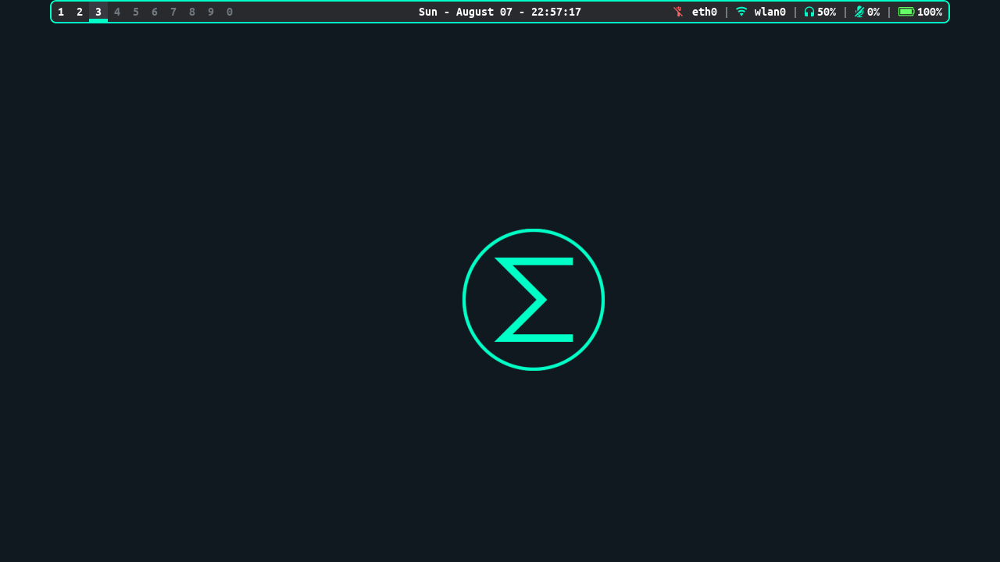
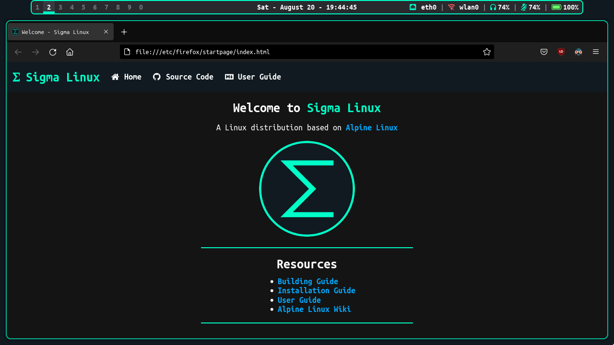
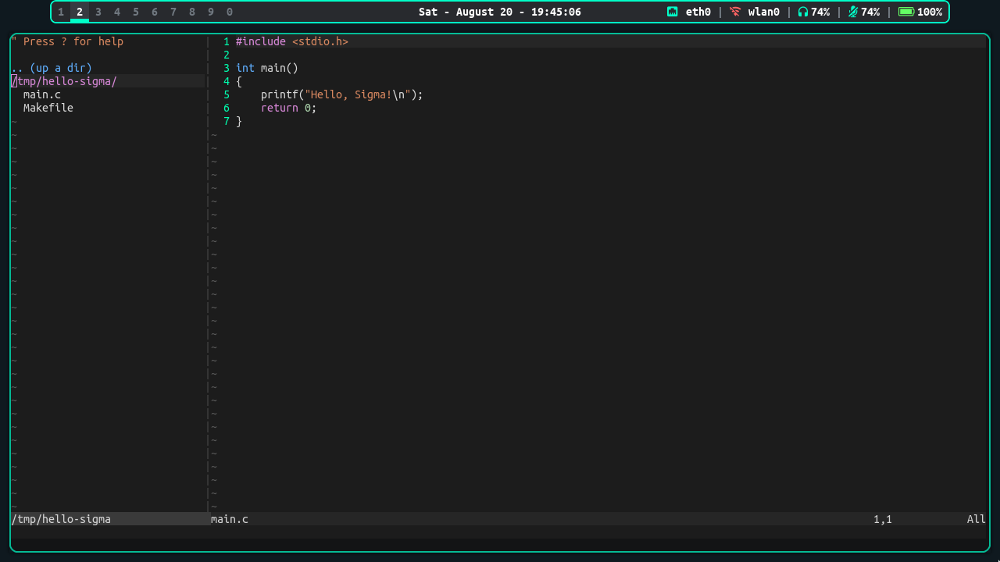

# Sigma Linux
## A Linux distribuition based on Alpine Linux






# License
All the files in this repository follow the license in the file `LICENSE` present in this directory, unless explicitly said otherwise (e.g through a CREDITS or another LICENSE file)

# Software
- Display Manager: LightDM
- Window Manager: BSPWM
- Compositor: Picom
- Status Bar: Polybar
- Terminal: Alacritty
- Browser: Firefox

# Installing
- Download the ISO from the latest release
- Burn the ISO into a USB drive or some device (run as root, use the proper device name): `dd if=alpine-sigma-edge-x86_64.iso of=/dev/sdX`
- Boot into Sigma Linux and login as the user `root` with no password
- Open a terminal with `Super + Enter` and run the command: `setup-sigma`
- Follow the installation steps and reboot

# Building (Docker)
Install Docker (run as root):
```
apk add docker
```

Activate and enable Docker (run as root):
```
rc-service docker start
rc-update add docker # optional
```

With Docker installed and running, setup the Dockerimage:
```
docker build -t sigma-linux .
```

Create the 'iso' folder:
```
mkdir -p iso
```

Spawn a shell in the Docker container and pass the 'iso' folder to it:
```
docker run -v $(pwd)/iso:/app/iso -it sigma-linux sh
```

Start the build process:
```
./build.sh
```

Leave the container:
```
exit
```

# Building (Manual)
Use Alpine Linux.  
Run the following commands as root.
Install the required packages:
```
apk update
apk add alpine-sdk build-base apk-tools alpine-conf busybox fakeroot syslinux xorriso squashfs-tools sudo mtools dosfstools grub-efi
```

Create a build user:
```
adduser build -G abuild
```

Give administrative access to the build user:
```
echo "%abuild ALL=(ALL) ALL" > /etc/sudoers.d/abuild
addgroup build wheel
```

Change to the build user:
```
su - build
```

Create signing keys for the build user:
```
abuild-keygen -i -a
```

Clone this repository if you haven't yet:
```
git clone --depth 1 <url>
```

Enter the repository folder and start the build process:
```
cd sigma-linux
./build.sh
```

# Notes

The output ISO file will be in the 'iso' folder inside the project directory, along with a sha256 checksum.

OBS: Clearing the cache might be needed for a rebuild:
```
./clean.sh
```
