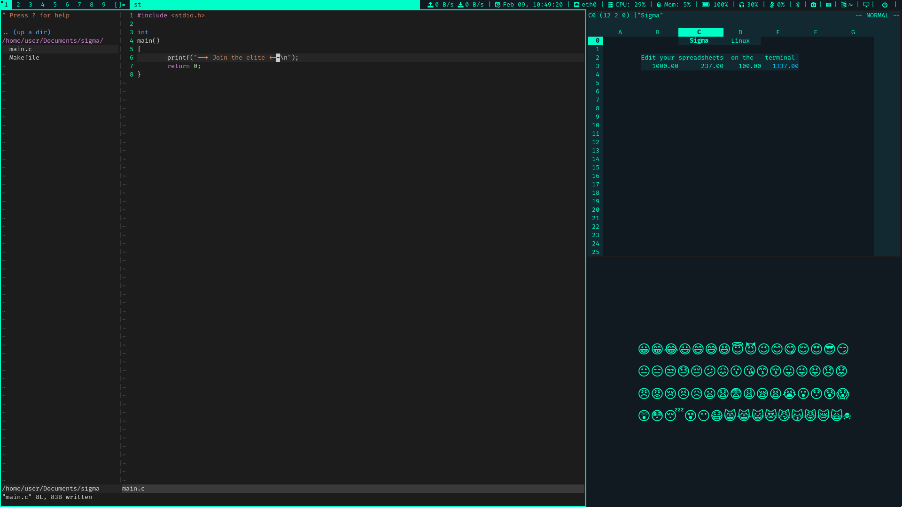
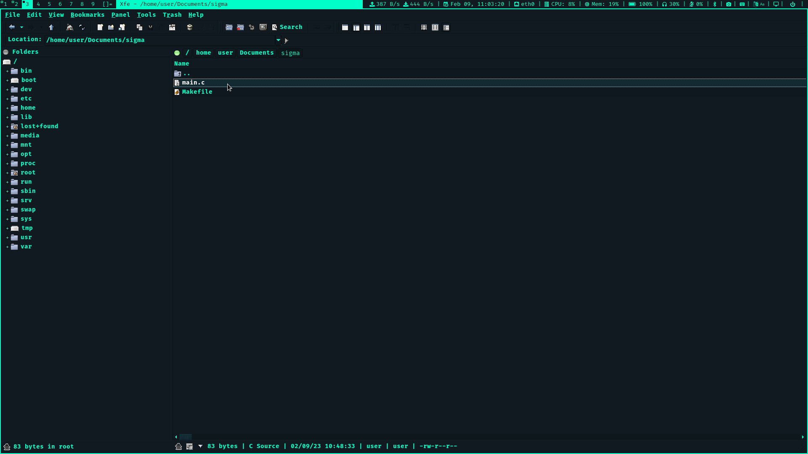
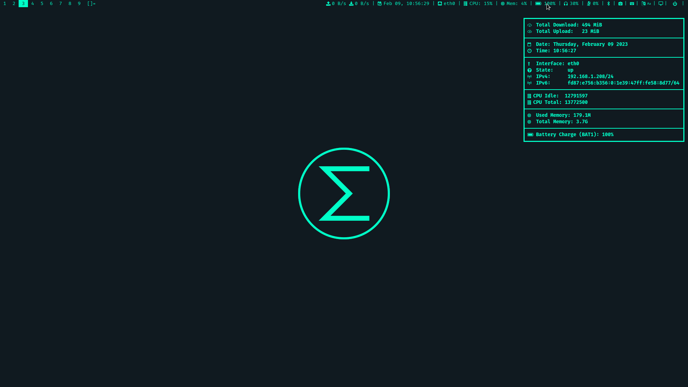
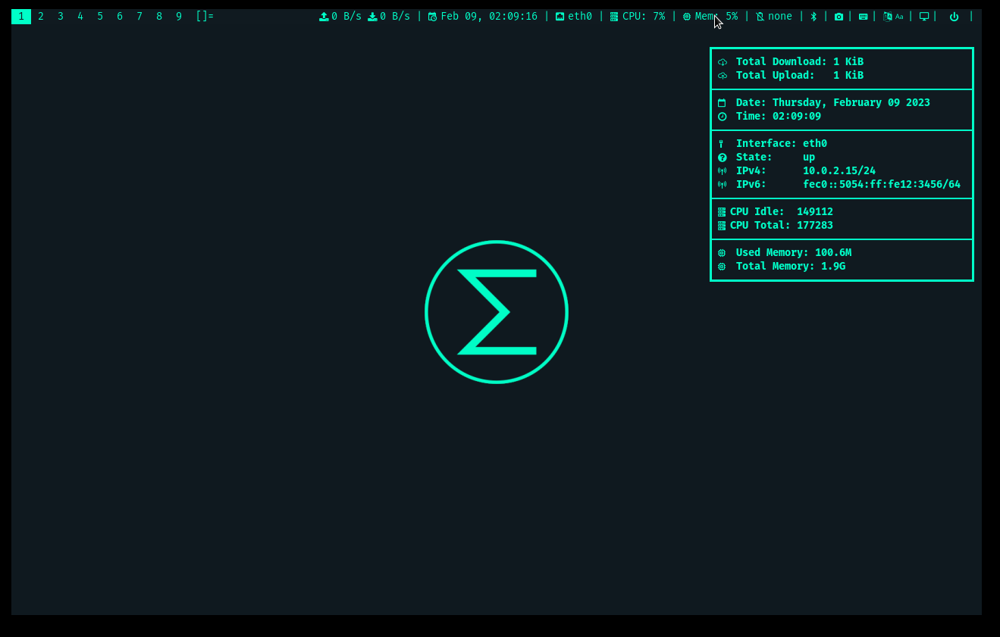

# Sigma Linux
## Elite operating system






# License
All the files in this repository follow the license in the file `LICENSE` present in this directory, unless explicitly said otherwise (e.g through a CREDITS or another LICENSE file)

# Software
- Window Manager: dwm
- Terminal: st
- Text Editor: vim
- Screen Locker: slock
- Notification Daemon: dunst
- Browser: surf
- Audio/Video Player: mpv
- Image Viewer: nsxiv
- Spreadsheet Editor: sc-im
- Slides Viewer: sent
- PDF Viewer: zathura
- Document Generator: groff
- Screenshot Tool: maim
- File Explorer: xfe
- Password Manager: pass with gnupg
- Image Editor: imagemagick
- Multimedia: ffmpeg
- IRC Chat: weechat
- Mail Client: neomutt
- RSS Feed: newsboat
- Virtual Keyboard: svkbd
- Audio Manager: pulsemixer
- Audio Server: pipewire
- Network Daemon: iwd
- VPN Tools: wireguard, openvpn
- Bluetooth Manager: bluez
- Init System: openrc
- Unix Tools: busybox
- C Standard Library (libc): musl
- C Compiler: tcc (Tiny C Compiler)
- Linker: mold

# Installing

**Recommended: 2GB RAM**

- Download the ISO from the latest release
- Burn the ISO into a USB drive or some device (run as root, use the proper device name): `dd if=alpine-sigma-edge-x86_64.iso of=/dev/sdX`
- Boot into Sigma Linux and login as the user `root` with no password
- Open a terminal with `Super + Shift + Enter` and run the command: `setup-sigma`
- Follow the installation steps and reboot
**Note**: read the manual if necessary, by pressing `Super + Shift + M`.

# Building (Docker)
Install Docker (run as root):
```
apk add docker
```

Activate and enable Docker (run as root):
```
rc-service docker start
rc-update add docker # optional
```

With Docker installed and running, execute the `docker-env.sh` script:
```
./docker-env.sh
```

Start the build process:
```
./build.sh -l
```

Leave the container:
```
exit
```

# Building (Manual)
Use Alpine Linux.

Run the following commands as root.

Install the required packages:
```
apk update
apk add alpine-sdk build-base apk-tools alpine-conf busybox fakeroot syslinux xorriso squashfs-tools sudo mtools dosfstools grub-efi grub-bios
```

Create a build user:
```
adduser build -G abuild
```

Give administrative access to the build user:
```
echo "%abuild ALL=(ALL) ALL" > /etc/sudoers.d/abuild
addgroup build wheel
```

Change to the build user:
```
su - build
```

Create signing keys for the build user:
```
abuild-keygen -i -a
```

Clone this repository if you haven't yet:
```
git clone --depth 1 <url>
```

Enter the repository folder and start the build process:
```
cd sigma-linux
./build.sh
```

# Notes

The output ISO file will be in the 'out' folder inside the project directory, along with a sha256 checksum.

OBS: Cleaning up might be needed for a rebuild:
```
./clean.sh
```
